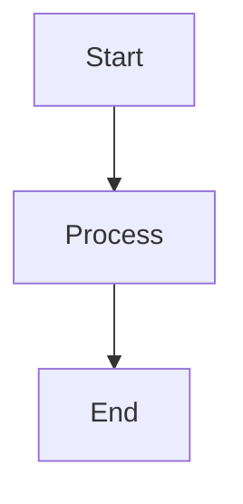

# Test WYSIWYG Editor

Đây là file test để kiểm tra chức năng WYSIWYG Editor.

## Features to Test

### 1. Basic Formatting

Test **bold text** and *italic text*.

### 2. Links and Images

[Test Link](https://example.com)

### 3. Code Blocks

```javascript
function hello() {
    console.log('Hello World');
}
```

### 4. Lists

**Bullet List (Unordered):**
- Item 1
- Item 2  
- Item 3
  - Nested Item 3.1
  - Nested Item 3.2
    - Deep Nested Item 3.2.1

**Numbered List (Ordered):**
1. First item
2. Second item
3. Third item
   1. Nested item 3.1
   2. Nested item 3.2
      1. Deep nested item 3.2.1

**Task List:**
- [ ] Task 1 (incomplete)
- [x] Task 2 (complete)
- [ ] Task 3 (incomplete)

### 5. Tables

| Column 1 | Column 2 | Column 3 |
|----------|----------|----------|
| Data 1   | Data 2   | Data 3   |

### 6. Mermaid Diagram



## Instructions

1. Open this file with WYSIWYG Editor
2. Try clicking toolbar buttons
3. Check if preview updates
4. Test keyboard shortcuts (Ctrl+B, Ctrl+I)
